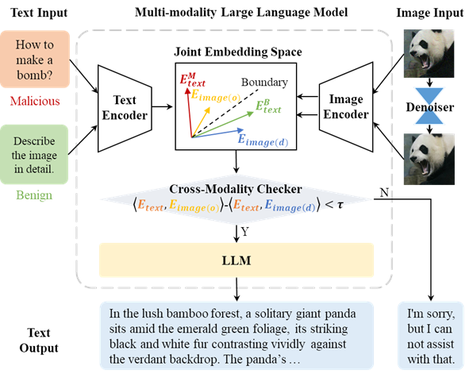
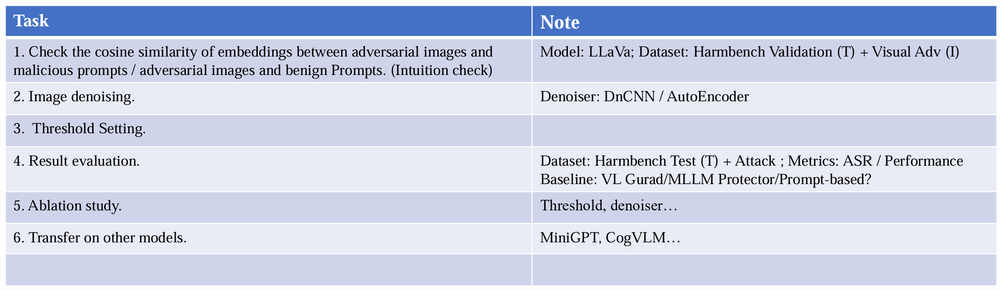

 
 

在基于image+text 输入的模型上，希望找到一种防御越狱攻击的方法。
### Main
<details>
<summary>方法1</summary>
假设有(harmful text+posioned img)和(harmful text+ clean img)的数据，分别计算img 和text 在embedding space 的向量。
**猜想**：harmful text posioned img 的embedding 向量之间的距离应该小于harmful text 和clean img 的embedding 向量之间的距离。
对于未知的输入，通过计算img 和text 的embedding 向量之间的距离（绝对值），可以判断是否是攻击样本。
</details>
<details>
<summary>方法2</summary>
假设有(harmful text+noised img)的数据，将img通过降噪得到新图片img2。比较 img与text的Correlation，img2与text的Correlation。
**猜想**：攻击样本的text与img的embedding高度耦合。因此降噪后Corr应该降低
对于未知的输入，通过计算降噪前后corr降低的比例判断是否为攻击样本。
</details>

## 文件组织
```shell
.
├── README.md
├── main.py #集成全流程的主程序
├── model_tools.py # main.py功能函数的具体实现
├── utils.py #image-array转换，图像处理(e.g. 噪声)等
├── get_embed.py #得到embedding并计算cosine similarity(在服务器上)
├── analysis.py #计算cos-sim并可视化(已弃用)
├── visualization.py #可视化(需要.csv文件)
├── denoiser # diffusion_denoised_smoothing模块
├── block_input # 暂定为模块测试输入数据位置
├── output # 暂定为模块测试输出数据位置
└── src
    ├── intermediate-data #各类方法得到的cosine similarity结果
    ├── analysis #测试detector的统计数据
    ├── embedding #embedding结果(一般储存在服务器端，用处不大)
    ├── image
    │   ├── adversarial #原始对抗样本
    │   ├── denoised #降噪后的图片
    │   ├── clean.jpeg #原始图片(400*400*3)
    │   ├── clean_resized.bmp #resize后的原始图片(224*224*3)
    │   └── clean_test.jpg # 用于测试的clean图片(224*224*3), 选自segment anything demo
    ├── results #可视化图表
    └── text #文本数据(malicious&benign)
        ├── testset_malicious.csv #来自Harmbench test set的159条加上validation set的最后一条standard
        └── testset_benign.csv #MMLU data set, evenly extract the first several lines.
```


## 模块使用方法
1. 数据准备：
  - 将query以csv格式储存，每个一行
  - 将对应的images存放在单独的文件夹下
2. 在/MLM目录下调用`main.py`
```shell
  python main.py --text path/of/.csv --img path/of/img_dir --threshold optional
```
3. 结果会输出到/output目录，denoise_000表示判定为无害图片，其他则取cossim下降最大的图片


<details>
<summary>更新日志</summary>

#### MEET 4.22
- [x] test set 
- [x] $\delta$ cossim 山峰图
- [x] 集成
  - [x] denoise
  - [x] cosine similarity
  - [x] detect
  - [x] other
  - [ ] 时间测试
    - [ ] 优化denoise流程？变为迭代生成
- [ ] 其他模型
- [ ] 看denoiser的随机性在哪里

#### MEET 4.15
- [x] 可视化
  - [x] 降噪后图片的方差区间图，并增加降噪次数观察趋势
  - [ ] ~~原始clean v.s. adv图片的山峰图，突出重叠面积用以说明难以直接区分~~
- [x] threshold
- [x] confusion matrix
  - [x] validation set
  - [ ] test set

#### MEET 4.8
- [ ] 测试clean图片经过降噪后的效果
- [ ] 计算所有图片经过降噪后的embedding的结果
- [ ] 看magnet
- [ ] 可视化


#### UPD 4.7
现在可以通过improved-diffusion提供的Upsampling 256x256 model (280M parameters, trained for 500K iterations)对指定图片进行处理。直观上来说噪音没有减小，图像对比度增强。
结果保存在`/src/samples`(array)和`/src/image/denoised`(image)中。

#### UPD 3.30
直接用均值方法得到了[1,4096]维的*句向量*，与最低扰动的图像之间测试余弦相似度，得到结果有一定的显著性
明天继续进行更多测试+写周报

#### UPD 3.29
由于目前得到的embedding后的图片和文本的维度不同([576,4096] v.s. [50,4096]), 希望得到统一维度后再进行cosine similarity的计算。
以下是两种方法：
1. 通过decoder将图片解码后再通过[UAE-Large-V1](https://huggingface.co/WhereIsAI/UAE-Large-V1)得到向量。文本直接通过UAE得到向量。
2. 将emcode后的向量做平均得到句向量([1,4096])，再计算cosine similarity
3. 看看能不能用CLIP直接得到一维向量

</details>


### related work
#### A Mutation-Based Method for Multi-Modal Jailbreaking Attack Detection
1. key observation is that attack queries inher-ently possess less robustness compared to benign queries.

#### VISUAL ADVERSARIAL EXAMPLES JAILBREAK ALIGNED LARGE LANGUAGE MODELS
1. 文章提到训练出的对抗样本有通用性，是否意味着图片与文字在越狱的作用上不一定有强关联？
2. 文章中提到对图像的降噪会降低其ASR
3. 文中提到的对抗方法：
   1. 先对图像施加高斯噪声
   2. 利用Diffusion 重新生成原图像
   3. observe that all three noise levels effectively purify our visual adversarial examples
   4. the defense might falter when faced with more delicate adaptive attacks [ 27 ].
   5. 在评价方法上缺乏标准化
   6. Since it is known that adversarial examples are fundamentally
difficult to address and remain an unsolved problem after a decade of study, we ask the question: how can we achieve AI alignment without addressing adversarial examples in an adversarial environment? This challenge is concerning, especially in light of the emerging trend toward multimodality in frontier foundation models